<div align="center">

# Renaiss Collector Assistant

### 面向 Renaiss 收藏家的 AI Skill：查卡、看钱包、追踪开包、发现连号 PSA 机会和市场价差。

本Skill旨在通过自然语言交互，将AI能力融入Reniass生态，让社区成员以对话的方式便捷参与项目、打通数据壁垒，并大幅降低理解与操作门槛。


**帮你更快找到好卡、看懂钱包成本、追踪 pack 动态、发现连号 PSA 和套利机会。**

**[👉 立即注册 Renaiss（邀请链接）](https://www.renaiss.xyz/ref/blueskyone)** &nbsp;|&nbsp; **[🐦 关注 @blueskylh1](https://twitter.com/intent/user?screen_name=blueskylh1)**

</div>

---

## 🎬 产品演示

<p align="center">
  <video src="media/demo/renaiss-collector-assistant-product-demo.mp4" controls width="900">
    你的浏览器不支持 HTML5 video 标签，请点击下方链接观看产品宣传视频。
  </video>
</p>

<p align="center">
  <a href="media/demo/renaiss-collector-assistant-product-demo.mp4"><strong>本地 MP4 宣传视频</strong></a>
  &nbsp;|&nbsp;
  <a href="https://youtu.be/JvZRrjviPjc"><strong>YouTube 演示视频</strong></a>
</p>

以下截图来自黑客松演示，展示 Agent 安装 skill 后可以直接完成的典型工作流：查卡、钱包分析、Pack 行情、定时监控、FMV / Index 套利扫描、PSA 连号机会和 Artist Helper。

| 场景 | 能力亮点 |
|---|---|
| Index 套利扫描 | 用 Renaiss OS Index exact cert 价格对比市场挂单，输出扣费后净值、利润率和置信度。 |
| FMV 套利扫描 | 批量扫描挂牌卡牌，按 FMV 折价和 2% 卖家费筛选候选。 |
| PSA 连号扫描 | 从市场挂牌卡里找 Sequential Cert / 连号 PSA 机会。 |
| 钱包分析 | 合并迁移前后钱包，统计 pack、buyback、marketplace、当前余额和 SBT。 |
| 卡牌查询与监控 | 按卡牌截图 / URL / cert 查询详情，并创建价格阈值监控。 |
| Artist Helper | 生成 Renaiss Artist SBT 可用的卡牌风格图和线稿参考。 |

<details open>
<summary><strong>1. Renaiss OS Index 套利扫描</strong></summary>

<p align="center">
  
</p>
<p align="center">
  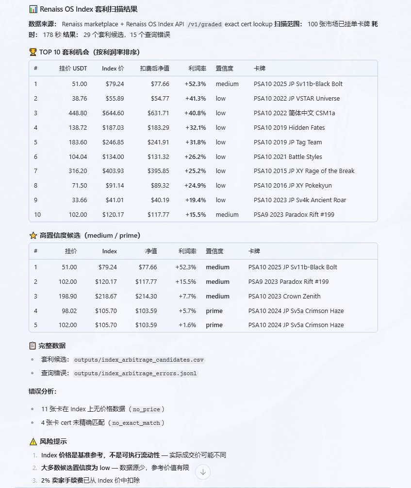
</p>

</details>

<details>
<summary><strong>2. FMV 折价套利扫描</strong></summary>

<p align="center">
  
</p>
<p align="center">
  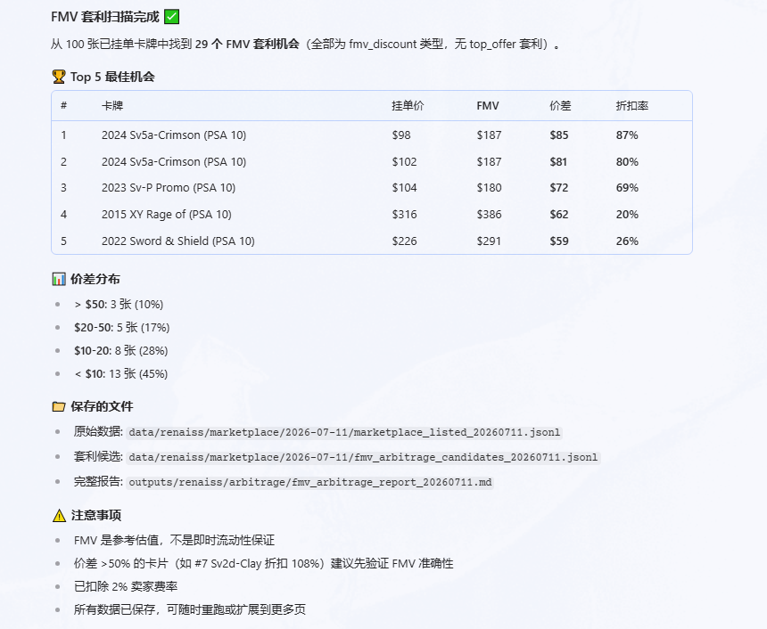
</p>

</details>

<details>
<summary><strong>3. PSA 连号机会扫描</strong></summary>

<p align="center">
  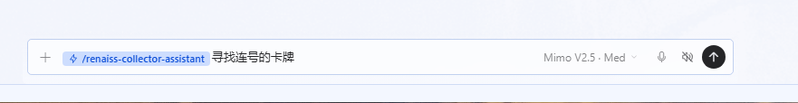
</p>
<p align="center">
  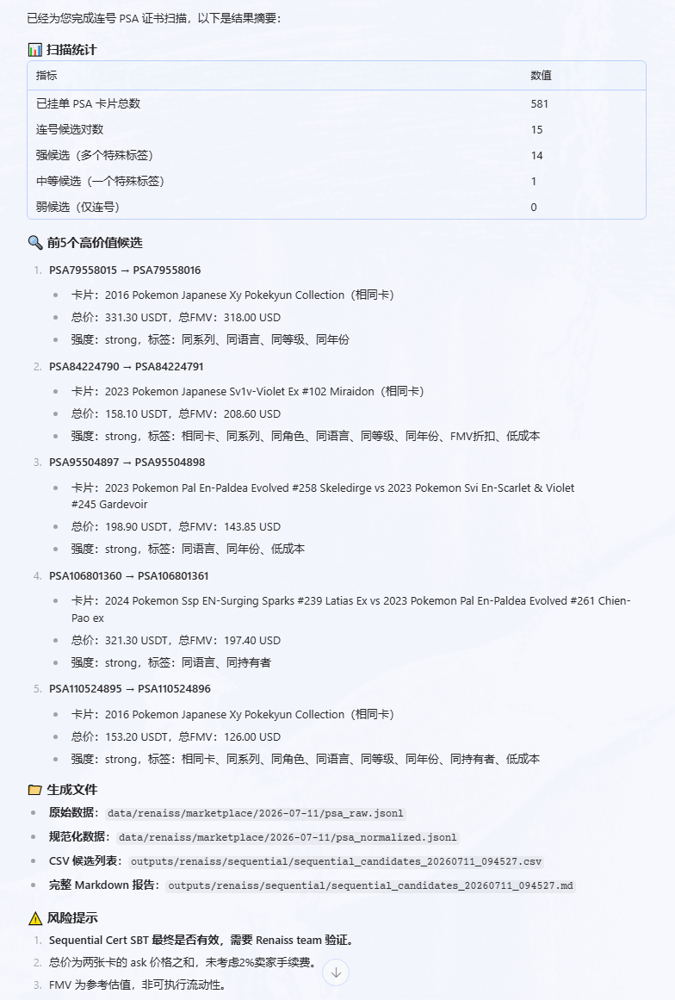
</p>

</details>

<details>
<summary><strong>4. Artist Helper 生成卡牌参考图</strong></summary>

<p align="center">
  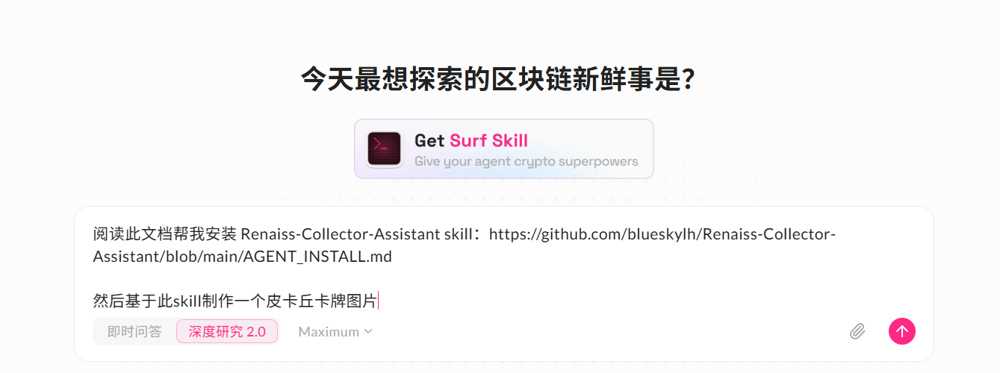
</p>
<p align="center">
  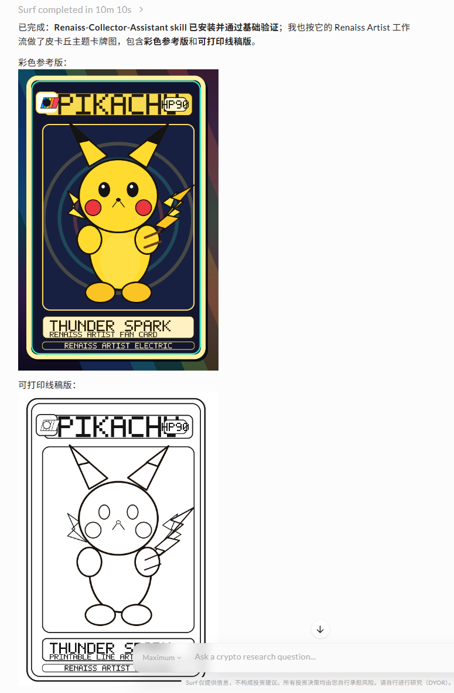
</p>

</details>

<details>
<summary><strong>5. 钱包分析</strong></summary>

<p align="center">
  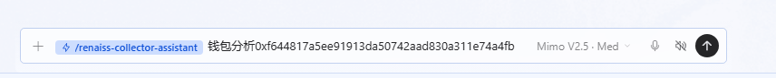
</p>
<p align="center">
  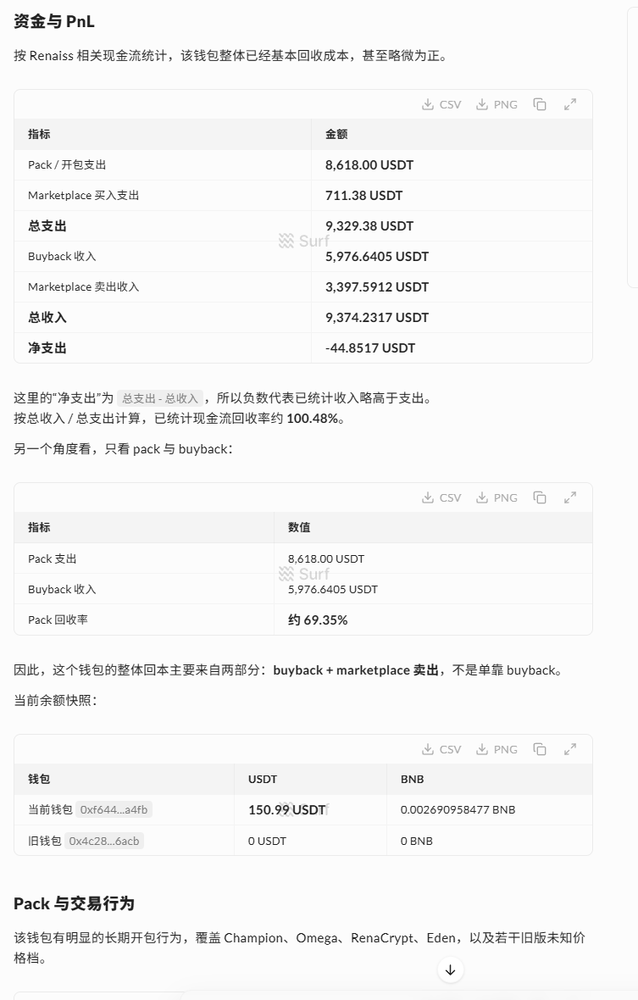
</p>

</details>

<details>
<summary><strong>6. 卡牌查询 + Index 参考价</strong></summary>

<p align="center">
  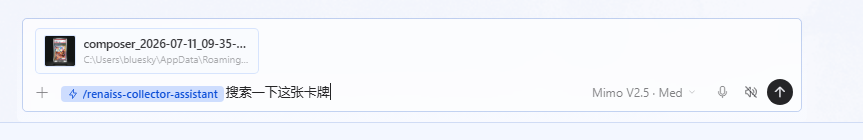
</p>
<p align="center">
  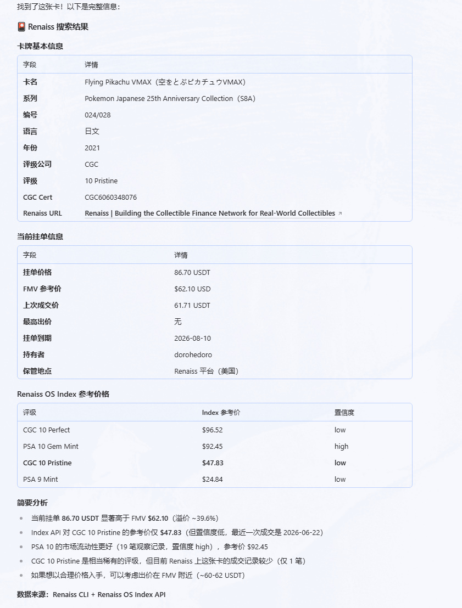
</p>

</details>

<details>
<summary><strong>7. 定时价格监控</strong></summary>

<p align="center">
  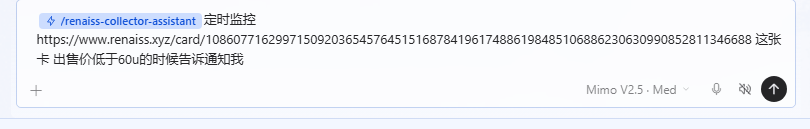
</p>
<p align="center">
  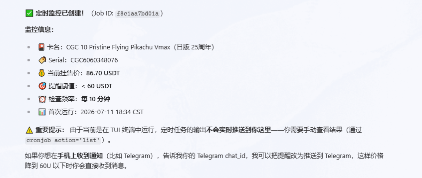
</p>

</details>

<details>
<summary><strong>8. Pack 市场与最新开包概览</strong></summary>

<p align="center">
  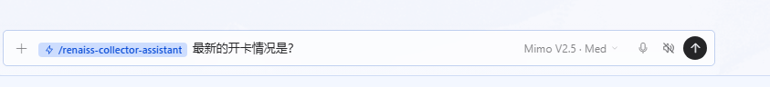
</p>
<p align="center">
  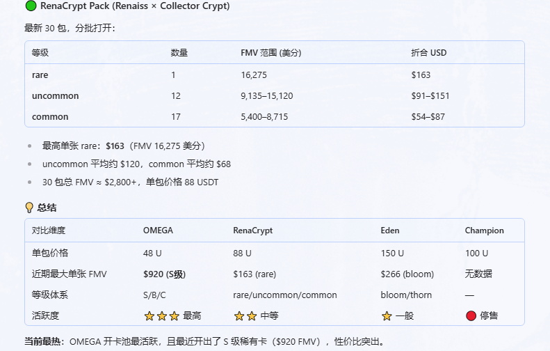
</p>

</details>

---

## ⚡ 快速安装

把下面这句话直接发送给你的 AI Agent：

```text
请先阅读并遵守 AGENT.md，然后阅读 AGENT_INSTALL.md 帮我安装 Renaiss-Collector-Assistant skill：
https://github.com/blueskylh/Renaiss-Collector-Assistant/blob/main/AGENT.md
https://github.com/blueskylh/Renaiss-Collector-Assistant/blob/main/AGENT_INSTALL.md
```

Agent 行为规则：[`AGENT.md`](./AGENT.md)<br/>
Agent 安装文档：[`AGENT_INSTALL.md`](./AGENT_INSTALL.md)

如果你的 agent 已经安装过这个 skill，请先按安装文档里的版本检查流程，对比本地 `manifest.json` 和 GitHub 仓库版本；GitHub 版本更新时再同步本地 skill，避免覆盖 `.env`、API key、输出数据和本地改动。

---

## ✨ 这个仓库是什么？

**Renaiss Collector Assistant** 是一个面向 Renaiss 收藏家的 AI 能力包。<br/>
它把 **Renaiss CLI、Renaiss OS Index API、Alchemy BNB Mainnet、BSC 链上数据、Marketplace 数据和收藏策略** 整合在一起，让你的 AI Agent 像收藏研究员一样工作。

它适合：

- 想快速查询 Renaiss 卡牌价格、FMV、owner、PSA cert 的收藏家；
- 想发现 Sequential Cert / 连号 PSA 机会的用户；
- 想批量扫描折价卡、价差和套利候选的用户；
- 想看懂自己或别人 Renaiss 钱包开包、买卖、迁移和 SBT 的用户；
- 想监控 pack、watchlist、市场变化和活动型 SBT 的用户。

---

## 🧩 功能概览

| 功能 | 能做什么 | 适合谁 |
|---|---|---|
| 🃏 **卡牌查询** | 查询 Renaiss 卡牌信息、价格、FMV、top offer、last sale、PSA cert、owner 和 vault 信息。 | 想快速了解某张卡价值和状态的收藏家 |
| 🔗 **PSA 连号扫描** | 扫描 Renaiss 市场在售卡牌，基于 `attributes.Serial` / PSA cert 发现可能用于 **Sequential Cert SBT** 的连号机会。 | 想找连号机会的收藏家 |
| 💹 **套利扫描** | 扫描所有正在出售的卡牌，计算扣除 **2% 卖方手续费** 后的潜在价差。 | 想找折价卡 / 套利机会的用户 |
| 📈 **Index 价格套利** | 使用 Renaiss OS Index API 价格和 Renaiss 市场挂牌价做对比，并显示 Index 价格置信度。 | 有 Renaiss OS Index API key、想批量找价格差的用户 |
| 👛 **钱包分析** | 合并迁移前后钱包，识别开包、批量开包、Buyback、Marketplace 买卖、当前 SBT 持仓和 SBT 名称。 | 想看自己或其他收藏家真实成本和收入的用户 |
| 📦 **Pack 监控** | 查询和监控 Renaiss 当前 pack、最近开包、tier、FMV 和 tokenId。 | 想追踪开包动态和高价值 pull 的用户 |
| ⏰ **卡牌 Watchlist** | 定时监控特定卡牌，跟踪价格、FMV、top offer、last sale、owner 和挂单状态变化。 | 想盯住目标卡牌价格变化的用户 |
| 🏅 **SBT 稀有度排名** | 基于 RenaissSBT ERC-1155 转账重建每个 SBT ID 的当前 holder 数和 supply。 | 想判断 SBT 稀有程度的收藏家 |
| 🎨 **Artist Helper** | 生成带有 Renaiss 元素的 TCG 卡牌线稿和彩色参考图，帮助用户获取 **Renaiss Artist SBT**。 | 想画 Artist SBT，但不想从零构图的用户 |

---

## 🔎 Renaiss OS Index API 支持

Renaiss OS Index API 可以作为 Renaiss Marketplace 之外的价格和卡牌索引来源。这个 skill 已经预留并接入以下能力：

| Index API 能力 | 用途 |
|---|---|
| Search | 搜索卡牌、系列、评级卡和价格信息 |
| Graded lookup | 按 PSA cert / graded cert 查询卡牌信息 |
| Indices | 查看 Index 支持的市场指数 / 数据集合 |
| Card by href | 通过 Index API 返回的 `href` 查询具体卡牌 |
| Index Price Arbitrage | 用 Index API 精确 cert 查询价格，对比 Renaiss 市场挂牌价，输出价格差和置信度 |

Index API 公共访问额度很低，只适合小测试；批量套利扫描建议先申请 partner key：

```text
https://index.renaissos.com/partners
```

配置到 `.env` 后脚本会自动读取：

```env
RENAISS_INDEX_API_KEY=
RENAISS_INDEX_API_SECRET=
```

安全提醒：不要把真实 key、secret、`.env`、截图或日志上传到 GitHub。

---

## 🔐 Alchemy API 配置（BSC 钱包分析需要）

Renaiss 钱包分析使用 **Alchemy BNB Mainnet** 来获取完整钱包历史并解码链上 receipt。Etherscan / BscScan 免费计划不适合这里的 BSC 钱包历史需求，所以推荐使用免费的 Alchemy key。

申请和配置步骤：

1. 打开 [Alchemy](https://www.alchemy.com/) 并注册 / 登录；
2. 在 Dashboard 创建一个新的 App；
3. Network 选择 **BNB Chain / BNB Mainnet**；
4. 复制 API key，写入 `.env`：

```env
ALCHEMY_API_KEY=your_alchemy_api_key_here
```

脚本会自动拼接 BNB Mainnet RPC URL：

```text
https://bnb-mainnet.g.alchemy.com/v2/<ALCHEMY_API_KEY>
```

也可以直接配置完整 URL：

```env
ALCHEMY_BNB_RPC_URL=https://bnb-mainnet.g.alchemy.com/v2/your_alchemy_api_key_here
```

请务必遵守：

- 不要把 `.env` 提交到 GitHub；
- 不要把真实 Alchemy key 写入 README、issue、日志、截图或报告；
- 如果 key 曾经公开暴露，请在 Alchemy Dashboard 里轮换 / 删除旧 key。

---

## 👛 钱包分析能力

钱包模块会把迁移前后钱包合并成 `wallet_cluster`，避免把迁移交易误算成买卖或收入支出。

支持能力包括：

- 自动识别 `LegacyAssetMigrationHelper` 迁移交易；
- 合并旧钱包和新钱包 history；
- 识别 Pack buy、批量开包、Buyback、Marketplace 买卖；
- 统计 USDT 支出 / 收入 / 净支出；
- 当前 RenaissSBT 持仓查询；
- 每个 SBT ID 的 holder 数 / supply 排名，用于判断稀有度；
- SBT metadata 解析，报告中显示名称而不是只显示 ID。

示例命令：

```bash
python3 scripts/bsc_wallet_analyzer.py wallet-report \
  --address 0x032e4a8eb38843a65ce5e65131d1f99c10b03201 \
  --history-source alchemy \
  --limit 1000 \
  --max-pages 20 \
  --max-wallets 20 \
  --out outputs/wallet_report.json \
  --out-md outputs/wallet_report.md
```

SBT holder 稀有度排名：

```bash
python3 scripts/bsc_wallet_analyzer.py sbt-holder-ranking \
  --max-pages 500 \
  --out outputs/sbt_holder_ranking.json \
  --out-csv outputs/sbt_holder_ranking.csv
```

如果输出 `complete=false`，说明 RenaissSBT 转账历史还没扫完，需要提高 `--max-pages` 后重跑。

---

## 🧠 多 Agent 工作流

这个仓库不是只给某一个 AI 产品使用的。只要你的 agent 支持读取 Markdown skill / instructions 和运行脚本，就可以接入。

支持多种 agent / runner 场景，包括：**SurfAI、Codex、GPT、Claude、Claude Code、豆包 Agent 办公模式、OpenClaw、Hermes、WorkBuddy、Grok** 等。

---

## 🗂 仓库结构

```text
.
├── README.md
├── AGENT.md
├── AGENT_INSTALL.md
├── media/
│   ├── images/
│   ├── videos/
│   └── product/
└── skills/
    └── renaiss-collector-assistant/
        ├── SKILL.md
        ├── scripts/
        ├── docs/
        ├── workflows/
        ├── examples/
        └── assets/
```

说明：

- `AGENT.md`：给 agent / runner 读取的仓库级规则；
- `AGENT_INSTALL.md`：详细安装指南；
- `media/`：产品截图、演示视频和宣传素材；
- `skills/renaiss-collector-assistant/`：agent 需要安装的 skill 源码目录。

---

## 🧰 环境要求

| 环境 | 版本 / 说明 |
|---|---|
| Node.js | **>= 22.0.0**，用于运行 Renaiss CLI |
| Python | **>= 3.11**，用于运行辅助脚本 |
| Renaiss CLI | 通过 `npx --yes renaiss` 调用 |
| Alchemy API key | 钱包历史 / BSC 链上分析建议配置；使用 BNB Mainnet 免费 key |
| Renaiss OS Index API key | 可选；批量 Index 价格套利扫描建议使用 |
| Wallet scan limit | 钱包报告默认最多扫描 20 个 cluster 地址，触顶会标记 partial |

---

## 🛡 收藏家提示

- FMV 是参考，不是保证成交价；
- top offer 可能撤回、过期或有额外条件；
- Renaiss OS Index 价格是参考基准，不是可立即成交的买单；
- Marketplace snapshot 使用临时文件 + 原子替换，失败刷新不应覆盖上一份完整数据；
- 套利计算默认扣除 **2% 卖方手续费**，gas 默认忽略；
- Sequential Cert / SBT 最终有效性以 Renaiss 官方确认为准；
- 钱包分析会合并迁移前后 wallet cluster，避免重复计算迁移交易；
- API key、`.env`、SSH 私钥、deploy key 都不要上传到 GitHub。

---

<div align="center">

**Renaiss Collector Assistant**<br/>
为想要更好数据、更快研究、更清晰决策的 Renaiss 收藏家而做。

</div>
